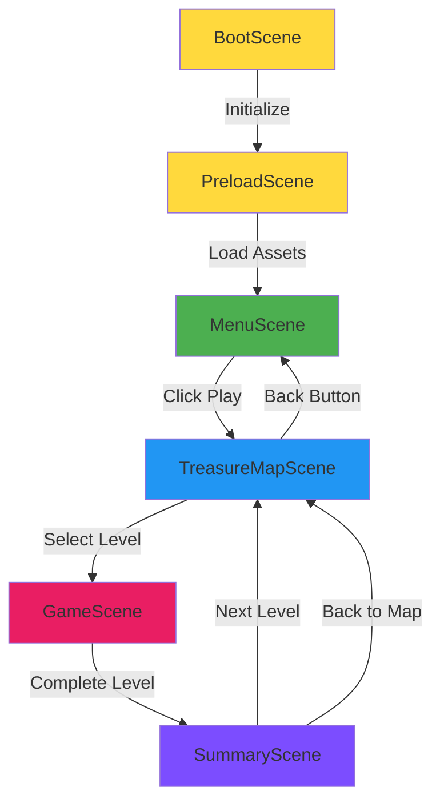

# System Architecture

**Project:** Kaka's Adventure
**Version:** 1.0.0
**Last Updated:** 2026-01-21

---

## Architecture Overview

Kaka's Adventure is a browser-based single-page application built with Phaser 3 game engine. The architecture follows a scene-based pattern where each screen (menu, level selection, gameplay) is a self-contained Phaser Scene. State management uses LocalStorage for persistence and in-memory objects for runtime state.

```
┌─────────────────────────────────────────────────────────┐
│                    Browser Environment                   │
├─────────────────────────────────────────────────────────┤
│  HTML Container (#game-container)                       │
│  ┌───────────────────────────────────────────────────┐  │
│  │           Phaser 3 Game Instance                  │  │
│  │  ┌─────────────────────────────────────────────┐  │  │
│  │  │         Scene Manager (Phaser)              │  │  │
│  │  │  ┌──────┐  ┌──────┐  ┌──────┐  ┌──────┐    │  │  │
│  │  │  │ Boot │→ │Preload│→ │ Menu │→ │ Map  │    │  │  │
│  │  │  └──────┘  └──────┘  └──────┘  └──────┘    │  │  │
│  │  │                         ↓          ↓        │  │  │
│  │  │                      ┌──────┐  ┌──────┐    │  │  │
│  │  │                      │ Game │→ │Summary│    │  │  │
│  │  │                      └──────┘  └──────┘    │  │  │
│  │  └─────────────────────────────────────────────┘  │  │
│  │                                                    │  │
│  │  ┌─────────────────────────────────────────────┐  │  │
│  │  │         Utility Managers                    │  │  │
│  │  │  - AudioManager (SFX, BGM, TTS)             │  │  │
│  │  │  - StorageManager (LocalStorage wrapper)    │  │  │
│  │  └─────────────────────────────────────────────┘  │  │
│  └───────────────────────────────────────────────────┘  │
├─────────────────────────────────────────────────────────┤
│  Browser APIs:                                          │
│  - LocalStorage (progress persistence)                 │
│  - SpeechSynthesis (TTS voice guidance)                │
│  - Keyboard Events (typing input)                      │
│  - Fullscreen API (immersive mode)                     │
│  - Web Audio (sound effects, music)                    │
└─────────────────────────────────────────────────────────┘
```

---

## Scene Flow Diagram

### Primary Scene Transitions



### Scene Lifecycle States

```
Start App
   ↓
BootScene.create() → Register fonts, set scale mode
   ↓
PreloadScene.preload() → Load all assets (audio, images, fonts)
PreloadScene.create() → Transition to MenuScene
   ↓
MenuScene.create() → Show Play button, controls
   ↓ (User clicks Play)
TreasureMapScene.create() → Load progress, render 50 level buttons
   ↓ (User clicks Level N)
GameScene.init(data) → Receive level number
GameScene.create() → Setup keyboard, target letters, virtual keyboard
GameScene.update() → Handle real-time input, animations
   ↓ (All content typed)
SummaryScene.init(data) → Receive stars, level number
SummaryScene.create() → Animate stars, show stats
   ↓ (User clicks Next Level)
TreasureMapScene.create() → Refresh with new unlocked level
```

---

## Data Flow Architecture

### Level Progression Flow

```
User starts game
   ↓
StorageManager.getCurrentLevel() → Read LocalStorage → Returns level 1 (or saved)
   ↓
TreasureMapScene renders 50 buttons
   - Unlocked: levels 1 to currentLevel
   - Locked: levels currentLevel+1 to 50
   ↓
User selects level 5
   ↓
GameScene receives { level: 5 }
   ↓
getLevelConfig(5) → Returns { content: ['F', 'J', 'D', ...], scoringMode: 'encouragement' }
   ↓
GameScene displays targets, listens for keyboard input
   ↓
User completes level (all letters typed)
   ↓
Calculate stars (1-10 based on scoring mode)
   ↓
StorageManager.setLevelStars(5, stars) → Save to LocalStorage
StorageManager.setCurrentLevel(6) → Unlock next level
   ↓
SummaryScene shows results
   ↓
User clicks "Next Level"
   ↓
Back to TreasureMapScene (level 6 now unlocked)
```

### Audio System Flow

```
GameScene.create()
   ↓
audioManager = new AudioManager(this)
   ↓
audioManager.playMusic(AUDIO.BGM.CHEESE_FACTORY)
   ↓
Check StorageManager.getMusicEnabled()
   - If false, skip playback
   - If true, play looping background music
   ↓
User types correct key
   ↓
audioManager.speakCorrect('F')
   ↓
SpeechSynthesis API: "F"
   ↓
audioManager.playSfx(AUDIO.SFX.CORRECT)
   ↓
Phaser Sound Manager plays sound effect
```

---

## Module Dependency Graph

```
main.ts
   ├─ config/game-config.ts
   │    ├─ config/constants.ts
   │    └─ scenes/*
   │         ├─ BootScene.ts
   │         ├─ PreloadScene.ts
   │         │    └─ config/constants.ts (AUDIO, SCENES)
   │         ├─ MenuScene.ts
   │         │    ├─ config/constants.ts
   │         │    └─ utils/audio-manager.ts
   │         ├─ TreasureMapScene.ts
   │         │    ├─ config/constants.ts
   │         │    ├─ data/lands-config.ts
   │         │    │    └─ config/constants.ts
   │         │    ├─ utils/storage-manager.ts
   │         │    │    └─ config/constants.ts
   │         │    └─ utils/audio-manager.ts
   │         ├─ GameScene.ts
   │         │    ├─ config/constants.ts
   │         │    ├─ data/level-data.ts
   │         │    ├─ data/lands-config.ts
   │         │    ├─ utils/storage-manager.ts
   │         │    └─ utils/audio-manager.ts
   │         └─ SummaryScene.ts
   │              ├─ config/constants.ts
   │              ├─ utils/storage-manager.ts
   │              └─ utils/audio-manager.ts
   └─ index.html
```

**Key Observations:**
- **constants.ts** is the most depended-upon module (single source of truth)
- **StorageManager** and **AudioManager** are used by multiple scenes
- **LevelData** and **LandsConfig** are only used by GameScene/TreasureMapScene

---

## Core Components

### 1. Scene Manager (Phaser Built-in)

Phaser's SceneManager handles scene lifecycle, transitions, and data passing.

**Responsibilities:**
- Register scenes from `gameConfig.scene[]`
- Start/stop/pause scenes
- Pass data between scenes (`scene.start(key, data)`)
- Maintain scene stack

**Key Methods Used:**
```typescript
this.scene.start(SCENES.GAME, { level: 5 }); // Start GameScene with data
this.scene.stop(SCENES.MENU);                // Stop MenuScene
this.cameras.main.fadeOut(300);               // Fade out transition
```

### 2. AudioManager (Custom Utility)

Centralized audio playback manager supporting SFX, BGM, and TTS.

**Responsibilities:**
- Play sound effects (correct, wrong, click, complete)
- Play/stop background music (looping per land)
- Text-to-Speech voice guidance (browser SpeechSynthesis API)
- Handle browser autoplay policy (resume suspended audio context)
- Toggle sound/music independently
- Persist settings to LocalStorage

**Key Methods:**
```typescript
audioManager.speak(text: string, rate: number): void
audioManager.speakLetter(letter: string): void
audioManager.speakEncouragement(): void
audioManager.playSfx(key: string, config?: SoundConfig): void
audioManager.playMusic(key: string, config?: SoundConfig): void
audioManager.stopMusic(): void
audioManager.toggleSound(): boolean
audioManager.toggleMusic(): boolean
```

**State:**
- `soundEnabled: boolean` (SFX on/off)
- `musicEnabled: boolean` (BGM on/off)
- `bgMusic: Phaser.Sound.BaseSound | null` (current playing music)
- `synth: SpeechSynthesis | null` (browser TTS API)

### 3. StorageManager (Custom Utility)

LocalStorage wrapper for saving game progress and settings.

**Responsibilities:**
- Store current unlocked level (1-50)
- Store stars per level (Record<number, number>)
- Store sound/music enabled states
- Provide getter/setter methods
- Handle JSON parsing errors gracefully

**Key Methods:**
```typescript
StorageManager.getCurrentLevel(): number
StorageManager.setCurrentLevel(level: number): void
StorageManager.getStarsPerLevel(): Record<number, number>
StorageManager.setLevelStars(level: number, stars: number): void
StorageManager.getSoundEnabled(): boolean
StorageManager.setSoundEnabled(enabled: boolean): void
StorageManager.resetProgress(): void
```

**LocalStorage Schema:**
```json
{
  "kaka_current_level": "15",
  "kaka_stars": "{\"1\":10,\"2\":10,\"15\":8}",
  "kaka_sound": "true",
  "kaka_music": "true"
}
```

### 4. Level Data Generator

Dynamically generates level content based on difficulty tier.

**Responsibilities:**
- Return appropriate content for levels 1-50
- Shuffle arrays for variety
- Define scoring mode per level range

**Key Functions:**
```typescript
getLevelConfig(level: number): LevelConfig
// Returns { level, content: string[], scoringMode }
```

**Content Tiers:**
- Levels 1-10: Home row letters (F, J, D, K, S, L, A, ;)
- Levels 11-20: Short words (CAT, SUN, BEE, BUG)
- Levels 21-30: Medium words (FISH, SHIP, SHELL, WATER)
- Levels 31-40: Long words (CANDY, SWEET, CAKE, COOKIE)
- Levels 41-50: Science words (STAR, MOON, EARTH, ROCKET)

### 5. Lands Configuration

Static configuration for 5 themed lands.

**Responsibilities:**
- Define color palette per land
- Map level ranges to lands
- Provide emoji icons
- Define background music keys

**Key Functions:**
```typescript
getLandByLevel(level: number): LandConfig
getLandById(id: number): LandConfig
```

**Land Data:**
```typescript
interface LandConfig {
  id: number;
  name: string;
  emoji: string;
  levelStart: number;
  levelEnd: number;
  primary: number;
  secondary: number;
  accent: number;
  content: 'letters' | 'words-short' | ...;
  bgm: string;
}
```

---

## State Management

### Runtime State (In-Memory)

Each scene maintains its own state during active lifecycle. State is passed between scenes via `scene.start(key, data)`.

**Example:**
```typescript
// TreasureMapScene
this.scene.start(SCENES.GAME, { level: 5 });

// GameScene
init(data: { level: number }) {
  this.currentLevel = data.level;
}
```

**State is NOT persisted** across page reloads unless explicitly saved to LocalStorage.

### Persistent State (LocalStorage)

**What is saved:**
1. Current unlocked level (1-50)
2. Stars per level (best score only)
3. Sound enabled (boolean)
4. Music enabled (boolean)

**What is NOT saved:**
- In-progress level state (users must restart level)
- Intermediate typing progress
- Audio context state (resets on page reload)

**Data Synchronization:**
- **Write**: After level complete (StorageManager.setLevelStars, setCurrentLevel)
- **Read**: On scene create (StorageManager.getCurrentLevel, getStarsPerLevel)

**Storage Quota:**
- Maximum usage: ~5KB (JSON string for 50 levels + settings)
- Browser limit: 5-10MB (well within limit)

---

## Detailed Scene Architecture

For comprehensive details on each scene (BootScene, PreloadScene, MenuScene, TreasureMapScene, GameScene, SummaryScene), see:

**[System Architecture - Scenes](./system-architecture-scenes.md)**

---

## Performance Considerations

### Asset Loading Strategy

**Preload All Assets (PreloadScene):**
- Audio files: MP3 format, ≤128kbps, ~50KB each
- Images: PNG for transparency, ≤500KB total
- Fonts: Google Fonts CDN (cached by browser)

**Total Asset Size:** ~2-3MB (acceptable for broadband)

**Future Optimization:**
- Lazy load land-specific assets (load on demand)
- Use sprite atlases for Kaka animations (reduce HTTP requests)

### Rendering Optimization

**Phaser Best Practices:**
- Reuse text objects (setText instead of destroy/create)
- Use object pools for frequently created/destroyed objects
- Limit particles to celebration scenes only
- Disable physics (not needed for this game)

**FPS Target:** 60 FPS on 2020+ laptops (Intel i5, integrated graphics)

### Memory Management

**Scene Cleanup:**
```typescript
shutdown(): void {
  this.audioManager.stopMusic();
  this.input.keyboard?.removeAllListeners();
  // Phaser automatically destroys scene objects
}
```

**Audio Context Handling:**
- Resume suspended context on user interaction (autoplay policy)
- Destroy sounds after scene change (prevent memory leaks)

---

## Security & Privacy

### No Backend Architecture

**Benefits:**
- No server costs
- No data breaches (no user data collected)
- No authentication complexity
- GDPR/COPPA compliant (no tracking)

**Limitations:**
- No cross-device sync
- No leaderboards (could add local-only)
- No analytics (could add privacy-friendly local metrics)

### LocalStorage Security

**Risks:**
- XSS attacks can read LocalStorage (but no sensitive data stored)
- Users can manually edit LocalStorage (acceptable for single-player game)

**Mitigations:**
- No sensitive data stored (just game progress)
- Validate data on read (handle JSON.parse errors)

---

## Deployment Architecture

### Build Pipeline (GitHub Actions)

```
Push tag (v1.0.0)
   ↓
Trigger deploy.yml workflow
   ↓
1. Checkout code
2. Setup Node.js 20
3. Install dependencies (npm ci)
4. Run type check (npm run typecheck)
5. Build project (npm run build)
   ↓
Vite build process:
   - TypeScript → JavaScript (ES2020)
   - Minify with esbuild
   - Output to dist/
   - Copy public/ assets to dist/assets/
   ↓
6. Upload dist/ as artifact
7. Deploy to GitHub Pages (gh-pages branch)
   ↓
Live at: https://vthuan1889.github.io/vibe-kktyping/
```

### Production Build Optimizations

**Vite Configuration:**
- Minification: esbuild (faster than Terser)
- Code splitting: Single bundle (small app)
- Asset hashing: Cache busting for updates
- Base path: `/vibe-kktyping/` (GitHub Pages subdirectory)

**Output:**
```
dist/
├── index.html
├── assets/
│   ├── index-[hash].js      # Main bundle (~200KB minified)
│   ├── index-[hash].css     # Styles if any
│   ├── audio/               # Sound files
│   └── images/              # Sprites, backgrounds
└── favicon.ico
```

---

## Scalability Considerations

### Current Limits (v1.0)

- **Max Levels:** 50 (hardcoded in level data)
- **Max Stars per Level:** 10 (scoring logic)
- **LocalStorage Quota:** 5-10MB browser limit (currently using <5KB)
- **Concurrent Users:** Unlimited (static hosting, no server)

### Future Scalability

**Custom Levels (v2.0):**
- Allow user-uploaded word lists (LocalStorage or JSON import)
- Increase level limit to 100+
- Store custom levels in IndexedDB (larger quota)

**Internationalization (v2.0):**
- Translate UI strings (JSON language files)
- TTS voice selection per language
- Locale-specific word lists

**Backend Integration (v3.0):**
- Optional cloud sync (Firebase, Supabase)
- Leaderboards (global high scores)
- Analytics (privacy-friendly, opt-in)

---

## Testing Strategy

### Manual Testing Checklist

**Scene Transitions:**
- [ ] Boot → Preload → Menu (no errors)
- [ ] Menu → TreasureMap (progress loads correctly)
- [ ] TreasureMap → Game (level data correct)
- [ ] Game → Summary (stars calculated correctly)
- [ ] Summary → TreasureMap (next level unlocked)

**Gameplay Mechanics:**
- [ ] Correct key advances target
- [ ] Wrong key shakes target (does not advance)
- [ ] All letters/words in level complete it
- [ ] Stars saved to LocalStorage
- [ ] Next level unlocks

**Audio:**
- [ ] Background music plays (per land)
- [ ] Sound effects play (correct, wrong, complete)
- [ ] TTS speaks letters/encouragement
- [ ] Audio toggle works (persist across reloads)
- [ ] No errors on Safari (suspended audio context handled)

**UI/UX:**
- [ ] Fullscreen mode works
- [ ] Virtual keyboard highlights correct key
- [ ] Finger guide visible (levels 1-10 only)
- [ ] Responsive scaling (maintains 16:9)
- [ ] Buttons have hover states

**Data Persistence:**
- [ ] Progress saves on level complete
- [ ] Progress loads on page refresh
- [ ] Stars display correctly on TreasureMap
- [ ] Settings (sound/music) persist

---

## Monitoring & Debugging

### Browser Developer Tools

**Console Logging:**
- Warnings for non-critical failures (audio, LocalStorage)
- No errors in production (all caught and handled)

**Network Tab:**
- All assets load successfully (200 status)
- No 404 errors for missing assets

**Performance Tab:**
- 60 FPS during gameplay
- No memory leaks (heap size stable)

**Application Tab:**
- LocalStorage populated correctly
- No quota exceeded warnings

---

## Future Architecture Enhancements

### 1. Component System (v1.1)
Extract reusable UI components:
- `Button.ts` (reusable button with hover/click)
- `VirtualKeyboard.ts` (keyboard visualization)
- `ProgressBar.ts` (level progress indicator)

### 2. Event System (v1.2)
Decouple scenes with event emitter:
```typescript
// GameScene
this.events.emit('level-complete', { level, stars });

// SummaryScene
this.events.on('level-complete', (data) => {
  // Handle completion
});
```

### 3. State Machine (v2.0)
For complex game states (paused, playing, transitioning):
```typescript
enum GameState { IDLE, PLAYING, PAUSED, COMPLETED }
class StateMachine { /* ... */ }
```

---

**Document Version:** 1.0
**Last Updated:** 2026-01-21
**Maintained By:** vthuan1889
